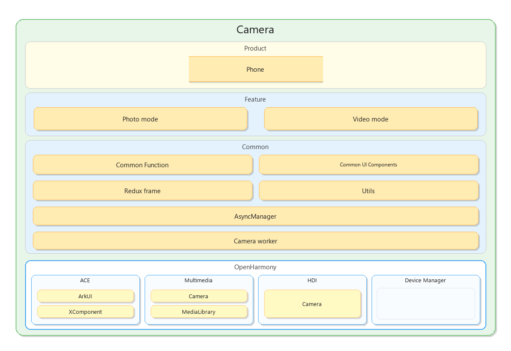

# Camera 源码说明
## 项目介绍
相机应用是OpenHarmony标准系统中预置的系统应用，为用户提供基础的相机拍摄功能，包括预览、拍照、摄像、缩略图显示、跳转相册。
Camera 采用纯 arkui-ts 语言开发。

### 核心功能
1. **基础拍照**：支持后置基础拍照，包含快门、照片回看、模式切换、百宝箱等功能；支持前置基础拍照。

2. **相机启动与系统适配**：支持多种相机进入方式，包括桌面启动和 ShortCut 启动特定模式（如直接进入录像/拍照模式等）；支持系统特性适配，包括屏幕旋转自适应。

3. **相机设置页**：提供丰富的拍摄设置选项，包括：参考线、水平仪、定时拍摄、拍摄静音、悬浮快门键等。

4. **百宝箱（拍摄辅助功能汇总）**：将常用拍摄辅助功能集中收纳，包括：参考线、设置入口等。

5. **基础录像**：支持后置基础录像，包含录像中拍摄（边录边拍照片）等功能；支持前置基础录像，同样包含录像中拍摄等功能。

6. **相机 Picker（选择器）**：提供系统级相机选择器能力，支持拍照 Picker等模式。

### 整体架构



Camera应用整体采用了多模块的设计方式，每个模块都遵循上述架构原则。

各层的作用分别如下：
- **Product层**：区分不同产品，不同屏幕的各形态，含有应用窗口、个性化业务，组件的配置以及个性化资源包。
- **Feature层**：抽象的公共特性组件集合，每个特性解耦独立可打包为har，可以被每个业务态所引用。
- **Common层**：负责数据服务、UI组件、工具组、数据持久层、动效层、外部交互层等部件内公共能力，每个应用形态都必须要依赖的模块。


## 目录<a name="section161941989596"></a>

````
applications_camera
├─ AppScope/                       # 应用范围配置（工程级）
├─ product/                        
│  ├─ phone/
│  │  └─ src/main
│  │     ├─ ets/
│  │     │  ├─ Application/         # 应用级 AbilityStage / 全局初始化
│  │     │  ├─ MainAbility/         # 主 Ability
│  │     │  ├─ pages/               # 页面（UI 页面入口、页面编排）
│  │     │  ├─ common/              # phone 
│  │     │  ├─ ServiceExtensionAbility/
│  │     │  ├─ UIExtensionAbility/
│  │     │  ├─ formAbility/
│  │     │  ├─ camerawidget/
│  │     │  ├─ collaboration/
│  │     │  ├─ Calibration/
│  │     │  └─ res/                 # ets 侧资源/封装
│  │     └─ resources/              # phone 资源（media/element/profile/rawfile 等）
│  ├─ picker/ ...
│
├─ common/                          # “共享模块” common（跨产品/跨业务复用）
│  ├─ src/main
│  │  ├─ ets/
│  │  │  ├─ camera/                 # 相机核心通用（childthread/uithread/modules 等）
│  │  │  ├─ component/              # 通用组件（settingview、xcomponent、thumbnail…）
│  │  │  ├─ service/                # 通用服务（UIAdaptive、medialibrary…）
│  │  │  ├─ function/               # 通用功能块（capture、recordcontrol…）
│  │  │  ├─ mode/                   # 模式/转换
│  │  │  ├─ redux/                  # Redux actions/reducer/store
│  │  │  ├─ worker/                 # worker/eventbus 等
│  │  │  ├─ utils/                  # 工具
│  │  │  ├─ statistics/             # 统计埋点
│  │  │  ├─ animation/ restore/ rpcclient/ default/
│  │  │  └─ ...
│  │  └─ resources/                 # common 模块资源
│  ├─ lib/                          # common 模块的库/产物
│  └─ oh_modules/                   # 模块依赖
│
├─ features/                        # “业务模块集合”（目前是 extend/photo/video 三块）
│  ├─ photo/
│  │  ├─ src/                       # photo 业务源码（拍照域）
│  │  └─ oh_modules/
│  ├─ video/
│  │  ├─ src/                       # video 业务源码（录像域）
│  │  └─ oh_modules/
│  └─ extend/
│     ├─ src/                       # 扩展能力（如 UIExtensionAbility 相关、扩展点等）
│     └─ oh_modules/
│
├─ signature/                       # 证书目录
├─ open_source/                     # 开源依赖/声明
├─ LICENSE  README.md  README_zh.md # 文档

````
## 相关仓

[**camera**](https://gitcode.com/openharmony/applications_camera)